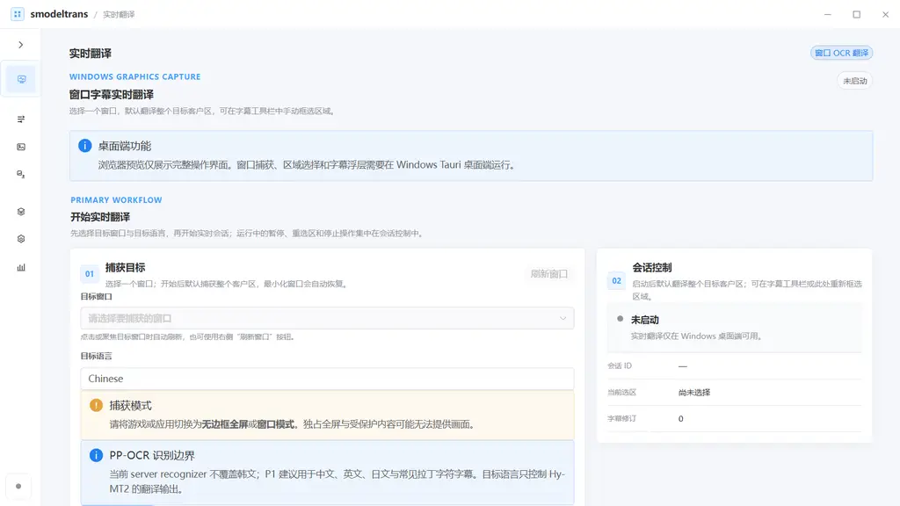
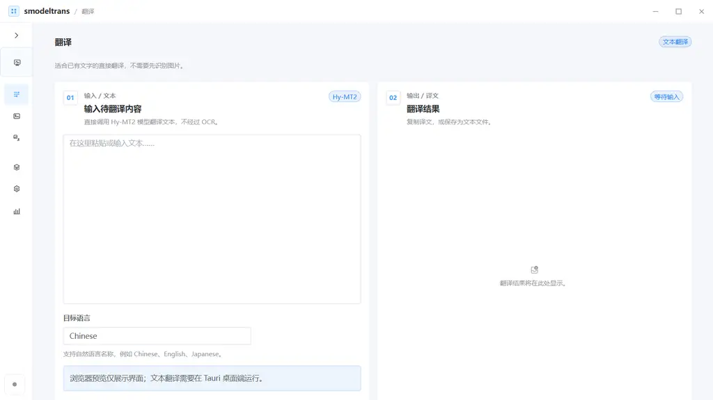
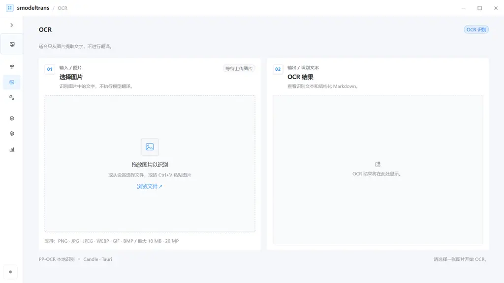
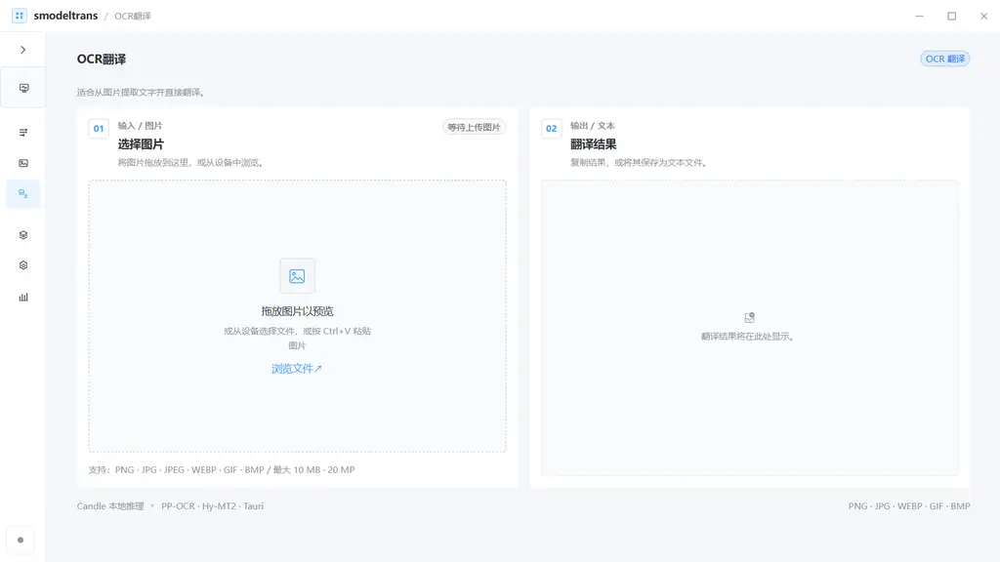
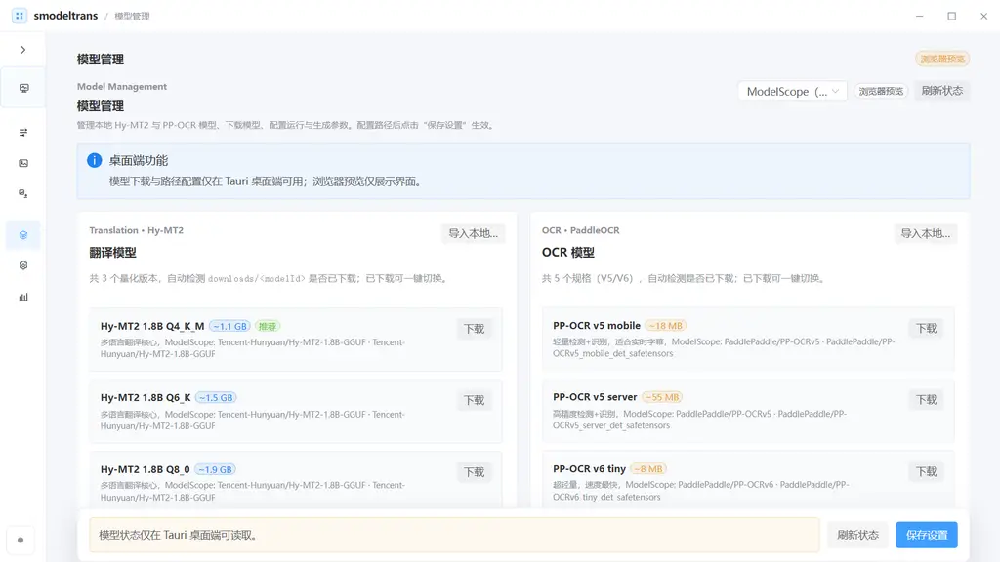
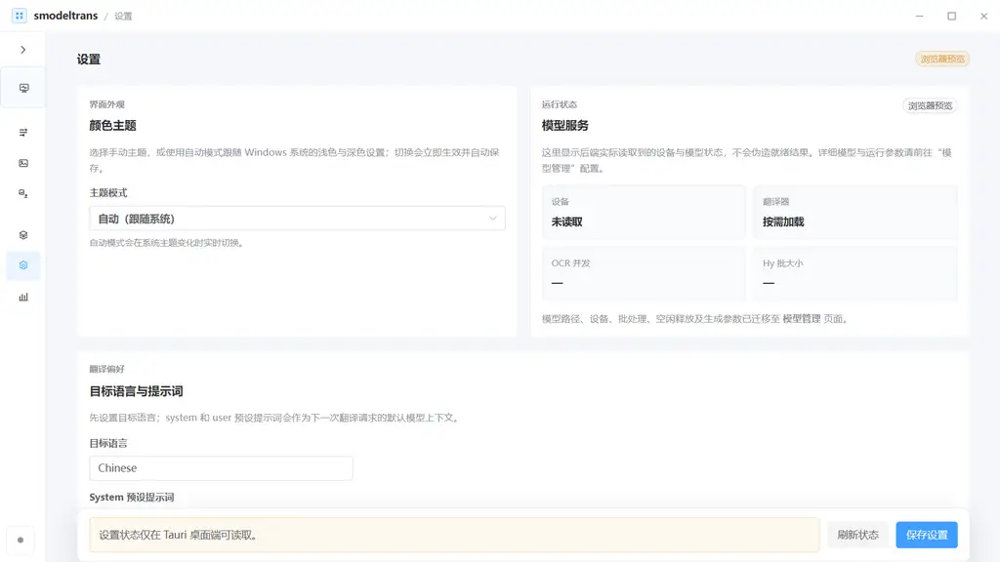
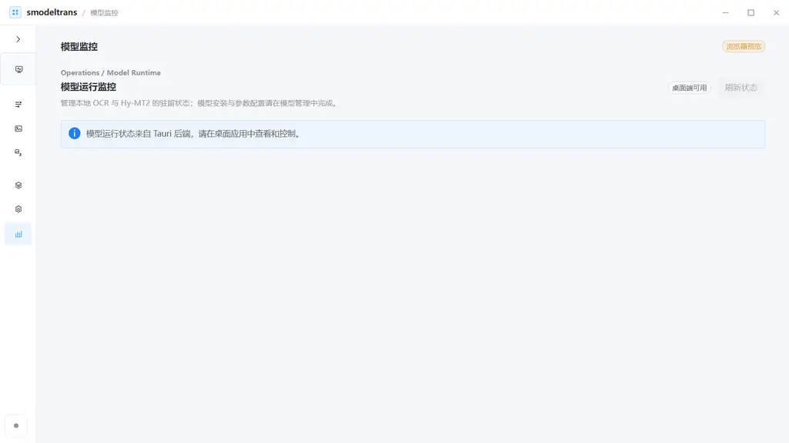
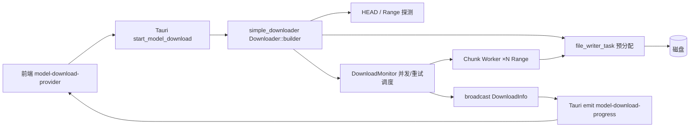

# smodeltrans — 实时翻译工具

> Windows 原生实时翻译桌面应用：**窗口捕获 → PP-OCR → Hy-MT2** 全本地推理。Tauri 2 + Vue 3 + Candle，覆盖实时字幕、文本翻译、OCR、OCR 翻译与本地模型管理。



---

## 定位

不是截图再压缩的“伪实时”，也不是云端 API 套壳。`smodeltrans` 在 Windows 上通过 **Graphics Capture** 直接获取 `BGRA8` 原始帧，ROI 无损裁剪 → PP-OCR 检测/识别 → Hy-MT2 流式翻译 → 覆盖层实时回贴，全链路在本地 Candle 上执行，离线可用、延迟可控。

适合：游戏/会议/直播字幕实时翻译、桌面任意窗口文字实时转写、外文 PDF/图片批量 OCR 与翻译。

---

## 预览

> 以下为 Web 预览（`bun run dev`）截图，真实窗口捕获、覆盖层、模型下载与 GPU 推理需在 **Windows Tauri 桌面端**运行。`Tauri` 边界内侧为真实 `candle`/`windows-capture` 调用。

| 实时翻译（Live） | 文本翻译 | OCR |
|---|---|---|
|  |  |  |
| 选择窗口 → ROI 窗口/全客户区 → 自动/按键触发 → 字幕或逐区覆盖 | 直通 Hy-MT2，无 OCR | 拖拽/粘贴图片，PP-OCR 本地识别 |

| OCR 翻译 | 模型管理 | 设置 / 监控 |
|---|---|---|
|  |  |   |
| 图片 → OCR → 翻译一键完成 | Hy-MT2 3 档 + PP-OCR V5/V6 5 档，ModelScope 按需下载 | 主题/语言/提示词；运行时监控与空闲卸载 |

---

## 功能

### 1. 实时窗口翻译（核心）
- **原生捕获**：`windows-capture` + Graphics Capture，BGRA→RGB 零编码，ROI `24×24` 起步，版本化去重过期结果。
- **双触发**：`automatic` 稳定性调度或 `key_trigger`（`F8`/自定义 `vk:`）按下/松开触发，带稳定等待与按键超时。
- **文字重组**：检测 → 透视/旋转校正 → 识别批处理 → 有界复核（仅对疑似噪声/英文 contraction 相邻区） → 行分组/碎片合并。
- **双覆盖层**：字幕模式（附着边/偏移）或逐区替换（回贴到原 quad），支持显示原文/框线。

### 2. 文本翻译
直通 `Hy-MT2 1.8B` GGUF（Q4_K_M / Q6_K / Q8_0），`VarBuilder + candle-flash-attn` 加速，`target_language` 自然语言（`Chinese`/`English`/`Japanese`…），支持 System/User 提示词与翻译记忆（token/轮次预算）。

### 3. OCR 与 OCR 翻译
- 拖拽、文件选择、`Ctrl+V` 粘贴，`PNG/JPG/WEBP/GIF/BMP ≤10MB / 20MP` 校验。
- PP-OCR V5 mobile/server、V6 tiny/small/medium，检测+识别 + CTC 解码，字符级坐标回贴。

### 4. 模型管理 + 下载
基于 [`izumkineno/simple_downloader`](https://github.com/izumkineno/simple_downloader)（Tauri 侧 `simple_downloader = { version = "0.3.1", features = ["resume","progress"] }`）：

| 能力 | 对应 |
|---|---|
| 单源多线程 + 动态并发探测（Probing→Stable） | `Downloader::builder(url, dest).workers(8)` |
| 断点续传（`resume`） | segment ledger + 哈希校验，sidecar 元数据，缺文件 fail-stop，`builder.resume(true)` |
| 进度事件（`progress`） | `update_interval(0.5)` + `run(|total, rx| …)` 广播 `DownloadInfo` 到 `model-download-progress` |
| 两级重试 | 即时重试 + 延迟重试队列，应对 CDN 抖动 |
| 文件探测兼容性 | `HEAD` 失败回退 `Range: bytes=0-0` 解析 `Content-Range` |
| ModelScope 适配 | `https://www.modelscope.cn/models/{repo}/resolve/master/{file}`，显式浏览器 UA + `auth_key` 续期，`MAX_RETRIES=5` |

下载源默认 `ModelScope`，备选 `HuggingFace`，按族分组（Hy-MT2 translation / PP-OCR）族内下拉选择，已安装检测基于 `downloads/<modelId>`。

### 5. 运行与可观测性
- `BackendState` 统一 `settings: Result<BackendSettings,String>`，`model_root` 匹配读取。
- `GpuExecutionPolicy` + 预热，空闲自动卸载（可配置），`model-monitor` 实时查看驻留/显存。
- 前端 `Naive UI` + `FSD-lite`，`vue-tsc` 严格类型，`light/dark` 自动跟随系统。

---

## 架构

### 技术栈
`Tauri 2` · `Vue 3` · `TypeScript 5.8` · `Naive UI` · `Vite 8` · `Rust` · `Candle 0.11`（`candle-core`/`candle-nn`/`candle-transformers` `cuda` 统一特性）· `simple_downloader 0.3.1` · `windows-capture 2.0`

### 端到端链路


更完整参数与三套坐标系见 [`docs/LIVE_OCR_PIPELINE.md`](docs/LIVE_OCR_PIPELINE.md)。

### 模型下载时序（simple_downloader 集成）



`Downloader` 内部：`DownloadMonitor` 控制面（`DownloadState`/`ConcurrencyManager`/`RetryHandler`）与执行面通过 `broadcast`/`mpsc` 解耦，EMA 平滑速度，有界通道反压防 OOM。详见 [`simple_downloader` 架构文档](https://github.com/izumkineno/simple_downloader/blob/main/docs/architecture.md)。

---

## 快速开始

```bash
# 1. 安装
bun install

# 2. Web 预览（仅 UI，捕获/模型下载需桌面端）
bun run dev              # http://127.0.0.1:5173

# 3. 预览生产包
bun run build && bun run preview

# 4. 桌面端（Windows，CUDA 可选）
bun run tauri dev
# 或
cargo run --manifest-path src-tauri/Cargo.toml --no-default-features --features cuda,flash-attn
```

> 严禁触发 `candle-flash-attn` 清理后重编（`cargo clean` 后 `cargo build` 会超长编译）。日常用 `cargo check --no-default-features --features cuda,flash-attn` 校验；参考 [`AGENTS.md`](AGENTS.md)。

---

## 使用

### 实时翻译
1. 打开 `实时翻译` → `刷新窗口` 选择目标窗口与 `目标语言`。
2. `开始实时翻译` 默认全客户区；字幕工具栏可重选 ROI（≥24×24）。
3. 自动模式持续出字幕；按键模式按 `F8`（可录入 `vk:`）触发。
4. 覆盖层：字幕（底部/顶部附着）或逐区替换。

> 需 `无边框全屏`/`窗口模式`，独占全屏/受保护内容无法捕获。

### 文本 / OCR / OCR 翻译
- **文本**：粘贴 → 选目标语言 → `Ctrl/Cmd+Enter` 翻译。
- **OCR**：拖拽/选择/粘贴图片 → 识别文本/Markdown。
- **OCR 翻译**：同上 + 自动翻译。

### 模型管理
`模型管理` → `ModelScope`（默认）→ Hy-MT2 `Q4_K_M/Q6_K/Q8_0` 与 PP-OCR V5/V6 `5 档` 按需 `下载/取消/导入本地`；`设置` 中配置 `model_root`、设备、批大小与空闲卸载后 `保存设置`。

新增模型需同步 `src-tauri/src/backend/model_download.rs` 与 `src/services/model-download-provider.ts` 清单及 `isModelInstalled`。

---

## 配置

| 项 | 位置 | 说明 |
|---|---|---|
| 版本单一来源 | `package.json` | `scripts/sync-version.mjs` 同步 `src-tauri/Cargo.toml` 与 `src-tauri/tauri.conf.json`；`App.vue` 动态读取，`model_download.rs` 用 `env!("CARGO_PKG_VERSION")` |
| 模型根目录 | 模型管理 → 设置 | `BackendState.settings.match` 读取 `model_root` |
| OCR 并发/批大小 | 模型管理 | `BackendEngine` 调度 |
| 实时识别/翻译 | 实时翻译 → 启动前配置 | `mode`/`triggerKey`/`stability`/`prompt`/`translationMemory` |
| 主题 | 设置 | `auto/light/dark` 跟随系统 |

---

## 开发

```bash
bun run build                 # vue-tsc --noEmit && vite build
cargo check --manifest-path src-tauri/Cargo.toml --no-default-features --features cuda,flash-attn
```

推荐：VS Code + Vue Official + Tauri + rust-analyzer。

文档：
- 工程边界与首版工作流：[`docs/ENGINEERING_PLAN.md`](docs/ENGINEERING_PLAN.md)
- 实时 OCR 完整链路：[`docs/LIVE_OCR_PIPELINE.md`](docs/LIVE_OCR_PIPELINE.md)
- 选区翻译研究：[`docs/SELECTED_TEXT_TRANSLATION_RESEARCH.md`](docs/SELECTED_TEXT_TRANSLATION_RESEARCH.md)
- UI 体系：[`docs/UI_REDESIGN_SYSTEM.md`](docs/UI_REDESIGN_SYSTEM.md) / [`docs/UI_REDESIGN_PAGES.md`](docs/UI_REDESIGN_PAGES.md)
- 下载器原理：[`simple_downloader` docs](https://github.com/izumkineno/simple_downloader/tree/main/docs)（`usage.md`/`architecture.md`/`configuration.md`）

---

## 路线

- 实时选区 OCR 翻译的快捷键全链路（已研究，待 `smodeltrans-build-accel` 约束下接入）
- 多源/代理下载（`simple_downloader` 的 `multi-source`/`proxy` 特性在仓库侧已就绪，应用侧按需开放）
- 覆盖层性能与多语言质量（需真实 CUDA fixture 复验，见 `LIVE_OCR_PIPELINE.md §6`）

## 许可证

与 [`simple_downloader` Apache-2.0](https://github.com/izumkineno/simple_downloader/blob/main/LICENSE) 保持一致的分发约束（如需商用请核对）。
