# 实时翻译 OCR 完整处理流程

> 本文是 `smodeltrans` 当前实现的开发文档，覆盖 Windows 实时翻译从窗口采集、ROI 映射、帧调度、PP-OCR 检测与识别、实时文本重组，到 Hy-MT2 翻译和前端覆盖层发布的完整链路。
>
> 文档以当前源码为准；修改实现时必须同步检查本文中的参数和流程。主要入口：`src-tauri/src/backend/live/mod.rs`、`src-tauri/src/backend/live/platform_windows.rs`、`src-tauri/src/backend/live/scheduler.rs`、`src-tauri/src/models/ppocr/adapter.rs`、`src-tauri/src/models/ppocr/geometry.rs`。

## 1. 端到端概览

实时翻译不是“截屏后压缩成图片再 OCR”。当前实现使用 Windows Graphics Capture 取得原始 `BGRA8` 帧，手动截取 ROI 并转换为 RGB；没有 JPEG/PNG 编码、解码或有损质量参数。

```mermaid
flowchart LR
    A[Vue 实时翻译页面] --> B[选择目标窗口]
    B --> C[框选 ROI]
    C --> D[Tauri begin/confirm 命令]
    D --> E[模型预热与 GPU 策略]
    E --> F[Windows Graphics Capture]
    F --> G[去标题栏/ROI 裁剪/BGRA→RGB]
    G --> H[LatestFrameSlot 最新帧槽]
    H --> I[自动稳定检测或按键触发]
    I --> J[PP-OCR detector]
    J --> K[文本四边形]
    K --> L[透视裁剪/旋转/识别批处理]
    L --> M[PP-OCR recognizer + CTC 解码]
    M --> N[有界质量复核与字符坐标]
    N --> O[实时区域去重/分行/碎片合并]
    O --> P[Hy-MT2 逐区域流式翻译]
    P --> Q[live-subtitle 事件]
    Q --> R[字幕覆盖层或逐区替换覆盖层]
```



一次成功的实时更新可概括为：

1. 捕获线程把目标窗口的最新 ROI 帧放入一个容量为 1 的槽位。
2. 会话线程根据识别模式和画面稳定性决定是否消费该帧并启动 OCR。
3. detector 在整张 ROI 上找文本区域；recognizer 对每个区域做透视校正和 CTC 识别。
4. recognizer 只对少量疑似噪声或漏失英文 contraction 的相邻原始区域做一次有界复核；实时后处理随后按视觉行重组已有结果，不再做整行二次识别。
5. Hy-MT2 按最终区域顺序逐个生成翻译，边生成边发送覆盖层更新。
6. ROI 版本、会话 ID 和 revision 用于丢弃过期结果，避免窗口变化或重新框选后的旧结果覆盖新结果。

## 2. 代码边界与数据对象

| 阶段 | 主要文件 | 核心对象/函数 |
| --- | --- | --- |
| 前端配置与 IPC | `src/components/LiveTranslationPage.vue`、`src/services/live-translation-provider.ts` | `beginLiveSelection`、`confirmLiveSelection`、`LiveRecognitionSettings`、`LiveTranslationSettings` |
| 会话生命周期 | `src-tauri/src/backend/live/mod.rs` | `LiveSessionManager`、`SessionLoop`、`prepare_models`、`run_capture` |
| Windows 捕获 | `src-tauri/src/backend/live/platform_windows.rs` | `start_capture`、`CaptureHandler::on_frame_arrived` |
| ROI 与设置契约 | `src-tauri/src/backend/live/contracts.rs` | `LiveRoi`、`NormalizedRoi`、`LiveConfig` |
| 稳定调度与文本重组 | `src-tauri/src/backend/live/scheduler.rs` | `StabilityScheduler`、`plan_live_ocr_groups`、`finalize_live_regions` |
| 模型调度 | `src-tauri/src/backend/engine.rs` | `BackendEngine`、`GpuExecutionPolicy` |
| OCR 模型适配 | `src-tauri/src/models/ppocr/adapter.rs` | `PpOcrProvider`、`detector_tensor`、`recognize_regions` |
| OCR 几何 | `src-tauri/src/models/ppocr/geometry.rs` | `DetectorProfile`、`crop_region`、`map_detector_quad` |
| 翻译模型 | `src-tauri/src/models/hy/translation.rs`、`session.rs` | `HyTranslator`、`translate_text`、`HySessionDriver` |
| 前端结果显示 | `src/components/LiveTranslationPage.vue`、`src/services/live-translation-provider.ts` | `live-subtitle`、`live-debug-record` |

### 2.1 三套坐标系

实时链路同时使用三套坐标，不能混用：

1. **目标客户区坐标**：窗口内容区域的物理像素，原点在客户区左上角；`LiveRoi.x/y` 和 `clientWidth/clientHeight` 使用此坐标。
2. **ROI 局部坐标**：捕获帧去掉标题栏并裁剪 ROI 后的坐标，OCR detector、recognizer 和 `RegionRecord.quad_points` 都使用此坐标。
3. **识别裁剪坐标**：某个四边形经过最小外接矩形、透视变换、旋转和 resize 后的局部坐标；字符框需要通过逆变换映射回 ROI 局部坐标。

发布逐区覆盖层时，后端将 ROI 原点加回区域局部坐标，再限制在目标客户区范围内。字幕模式只需要文本，不发布逐区区域列表。

### 2.2 关键运行时结构

OwnedFrame
  width / height       ROI 局部物理尺寸
  image                `Arc<RgbImage>`，RGB 字节按 `[R,G,B, ...]` 排列
  roi                  ROI 在目标客户区中的物理位置
  roi_version          当前 ROI/窗口尺寸版本
  observed_at_epoch_ms 捕获时间

RegionRecord
  order
  quad_points          ROI 局部坐标中的文本区域四边形
  source_text          OCR 原文
  translated_text      翻译结果
  characters           CTC 字符及其映射回原图的四边形
```

## 3. 会话启动与配置

### 3.1 前端配置

实时页面在启动前收集四组配置：

- 目标窗口：窗口句柄、标题、进程名和客户区尺寸。
- 识别设置：自动识别/按键触发、触发键、按下或松开触发、稳定等待、按键超时、文本分组开关。
- 翻译设置：目标语言、实时补充提示词、翻译记忆开关、记忆 token 预算、记忆轮数。
- 覆盖层设置：字幕模式或逐区替换模式、附着边、偏移、是否显示原文和区域框。

设置通过 Tauri 命令传入后端；后端重新校验，不能仅依赖前端校验。

### 3.2 默认值与边界

| 参数 | 默认值 | 有效范围/说明 |
| --- | ---: | --- |
| `LiveRoi.width/height` | 由用户框选 | 至少 `24 × 24` 物理像素，必须完全位于客户区 |
| `mode` | `automatic` | `automatic` 或 `key_trigger` |
| `triggerKey` | `F8` | 支持录入的标准键盘键，也支持 `vk:<number>|<code>` |
| `triggerEvent` | `press` | `press` 或 `release` |
| `stabilityWaitMs` | `300 ms` | `0..=5000 ms`；`0` 表示满足两次稳定观测后立即允许探测 |
| `keyTriggerTimeoutMs` | `1000 ms` | `100..=5000 ms`；仅按键模式使用 |
| `textGroupingEnabled` | `true` | 关闭后保留 detector 区域，不做实时行重组 |
| `supplementalPrompt` | 空 | 最多 4096 个 Unicode 字符，保存和后端校验时 trim |
| `memoryEnabled` | `true` | 实时设置的默认值；普通 `MemoryConfig` 默认值不同，不能混淆 |
| `memoryMaxTokens` | `4096` | `1..=262144` |
| `memoryMaxTurns` | `16` | `1..=1024` |

旧版前端持久化配置缺少新字段时，前端和 Rust serde 会补默认值。会话运行中配置编辑受到限制，修改后应重新启动或重新选择会话。

### 3.3 目标窗口、最小化状态与 ROI 版本

1. 前端调用 `list_capture_windows` 获取可捕获的顶级窗口。已最小化但仍存活的窗口也会列出；此时后端返回 `isMinimized=true` 且尺寸为 `0×0`，前端标注“已最小化，可直接恢复”。
2. `begin_live_selection` 校验目标语言、覆盖层、识别和翻译设置，先调用 `activate_target_window` 恢复并激活目标窗口，再读取客户区几何。
3. 用户在选择器窗口中框选 CSS 区域；前端根据设备像素比换算为物理像素，并保证最小 ROI 尺寸。
4. `confirm_live_selection` 再次校验 ROI，转换为 `NormalizedRoi`：
   - `left = x / client_width`
   - `top = y / client_height`
   - `right = (x + width) / client_width`
   - `bottom = (y + height) / client_height`
5. 捕获线程根据每一帧的实际客户区尺寸将归一化 ROI 四舍五入回物理像素。
6. 运行中每约 `250 ms` 检查目标是否最小化；每约 `500 ms` 同步客户区几何。窗口尺寸改变时 `roi_version` 自增、清空最新帧并重置稳定检测；任何旧版本 OCR/翻译结果都会被丢弃。
7. 目标运行中被最小化时，会话自动进入暂停状态、清空待处理帧并隐藏覆盖层。窗口恢复后重新定位覆盖层并自动继续；若此前是手动暂停，则只恢复几何和覆盖层，不解除手动暂停。手动点击“继续”时目标仍最小化会返回错误。

归一化 ROI 的意义是窗口缩放时保留相对位置；它不是对图像做缩放或压缩。Windows Graphics Capture 对最小化窗口通常不能提供可用画面，因此这里采用暂停/恢复，而不是声称可以在最小化状态下持续 OCR。

## 4. Windows 图像获取

### 4.1 Graphics Capture 配置

`platform_windows::start_capture` 使用 Windows Graphics Capture，当前参数为：

| 参数 | 当前值 | 作用 |
| --- | --- | --- |
| `CursorCaptureSettings` | `WithoutCursor` | 不把鼠标光标写入 OCR 图像 |
| `DrawBorderSettings` | `WithoutBorder` | 不绘制捕获边框 |
| `SecondaryWindowSettings` | `Exclude` | 排除辅助窗口 |
| `MinimumUpdateIntervalSettings` | `100 ms` | 限制捕获回调频率，避免无意义高频复制 |
| `ColorFormat` | `Bgra8` | 原始帧四通道格式 |
| Dirty region | 支持时 `ReportOnly` | 只报告变化区域，不让库替代完整帧逻辑 |

捕获对象是目标窗口，而不是整个桌面。帧进入回调后先调用 `buffer_without_title_bar()`，去掉非客户区标题栏。ROI 是按客户区定义的，因此必须在去标题栏后再做坐标映射。

### 4.2 ROI 复制与颜色转换

捕获回调执行以下操作：

1. 读取去标题栏 buffer 的宽高和无填充字节视图。
2. 用归一化 ROI 映射出当前帧中的 `x/y/width/height`。
3. 按行计算 BGRA 起始偏移，读取 ROI 内每个像素。
4. 丢弃 alpha，并把通道从 `[B,G,R,A]` 改为 `[R,G,B]`：

```text
for each BGRA pixel:
    rgb.push(BGRA[2])  // R
    rgb.push(BGRA[1])  // G
    rgb.push(BGRA[0])  // B
```

5. 构造 `OwnedFrame` 并写入 `LatestFrameSlot`。

这一段没有图像编码。不会发生 JPEG 质量损失，也不会因为 PNG 压缩级别导致字符变形。当前会发生的像素变换只有：ROI 裁剪、通道重排，以及后续 detector/recognizer 的 resize 和几何 warp。

### 4.3 Dirty region 与帧丢弃

- 如果 ROI 版本没有变化，且捕获尺寸与客户区匹配，dirty regions 与 ROI 完全不相交时跳过本帧。
- 该跳过计入 `framesSkippedUnchanged`。
- `LatestFrameSlot` 只有一个槽位。新帧到达时直接替换未消费帧；被替换的帧计入 `framesDropped`。
- 这是有意的“最新画面优先”策略：实时翻译不排队处理过时字幕，不保证每个捕获帧都进入 OCR。
- 捕获帧计数写入 `framesCaptured`。

### 4.4 当前 CPU 成本

捕获回调目前在 CPU 上完成：

- dirty-region 判断；
- ROI 行偏移计算；
- BGRA→RGB 逐像素复制；
- 直接构造 `RgbImage`，并通过 `Arc` 交给 `OwnedFrame` 和 `DecodedImage` 共享。

OCR 入口只克隆 `Arc`，不再复制整张 ROI 的 RGB 字节。该优化不改变任何像素、模型输入尺寸、归一化、阈值或解码结果；仍然没有图像压缩。捕获回调仍需为每个写入槽位的有效帧分配并填充 RGB 图像，因为捕获线程和会话线程可能并发持有不同帧。

## 5. OCR 调度：什么时候启动一次识别

### 5.1 自动识别模式

自动模式下捕获线程持续写入最新帧，会话线程持续读取并更新 `StabilityScheduler`。每个有效帧只做低成本的亮度签名采样，不会因为每个捕获回调都直接运行模型。

识别条件：

1. 至少观察到两次有效签名。
2. 连续签名没有超过变化阈值。
3. 从本轮稳定开始经过 `stabilityWaitMs`。
4. `suppressed_until_change` 尚未置位。

探测成功后会话线程抑制同一画面的再次 OCR，直到签名发生显著变化。

### 5.2 稳定性签名算法

`StabilityScheduler` 不缩放完整图像，只从 ROI 读取固定网格：

- 列数：`48`
- 行数：`28`
- 采样点数：`1344`
- 每点亮度：`(77*R + 150*G + 29*B) >> 8`

两次签名的差异为：

```text
mean_difference = sum(abs(left - right)) / (1344 * 255)
changed_ratio   = changed_cells / 1344
changed_cell    = abs(left - right) >= 18
```

画面被认为发生变化，当且仅当：

```text
mean_difference > 0.012
或
changed_ratio > 0.02
```

签名发生变化会重置稳定起点和连续稳定观测次数；签名相同则增加稳定观测次数。稳定调度只决定“何时 OCR”，不改变送入 OCR 的原始 ROI 像素。

### 5.3 按键触发模式

按键模式使用 Windows `GetAsyncKeyState` 查询配置的虚拟键，并检测边沿：

- `press`：当前按下且上一轮未按下。
- `release`：当前未按下且上一轮按下。

未触发时：

- 不运行 OCR；
- 重置稳定调度；
- 清除上一次待处理帧；
- 等待下一次触发。

触发后：

1. 记录 `trigger_wait_started`。
2. 继续接收最新帧并尝试等待画面稳定。
3. 如果稳定条件先满足，使用最新帧 OCR。
4. 如果经过 `keyTriggerTimeoutMs` 仍未稳定，但已有至少一帧，则强制使用最新帧 OCR。
5. 强制超时不会制造空帧；没有捕获到帧时仍不会启动 OCR。

因此按键超时是“避免永远等不到稳定画面”的兜底，不是图像压缩或识别质量参数。
### 5.4 暂停、最小化、窗口变化和取消

- 手动暂停时会话线程不消费模型工作，停止后续 OCR/翻译调度；手动恢复前会拒绝仍处于最小化状态的目标窗口。
- 目标窗口最小化时，运行线程自动暂停、清空 latest slot 并隐藏覆盖层；恢复后自动重新定位覆盖层并恢复运行。自动暂停不会覆盖手动暂停意图。
- 窗口尺寸或 ROI 变化会清空 latest slot、重置稳定状态并增加 ROI 版本。
- 会话停止、目标窗口关闭、配置锁/捕获错误都会结束捕获并关闭选择器和覆盖层。
- OCR 和翻译前后都检查 `CancellationToken`。

## 6. 模型加载、GPU 策略与预热

`BackendEngine` 根据设置创建 Candle `Device`。CUDA 模式下启动时查询总显存和可用显存，选择执行策略：

| 策略 | 条件 | OCR 区域并行度 | recognizer batch 像素预算 | 模型驻留 |
| --- | --- | ---: | ---: | --- |
| `gpu_resident` | 总显存 ≥ 8192 MiB 且空闲 ≥ 4096 MiB | 使用配置值 | `48×3200×16` | OCR 与 Hy 同时保留 |
| `gpu_balanced` | 空闲 ≥ 2500 MiB | 配置值上限 8 | `48×3200×8` | 按阶段切换 |
| `gpu_constrained` | 空闲 < 2500 MiB | 配置值上限 4 | `48×3200×4` | 按阶段切换 |
| `cpu` | CPU 设备 | 使用配置值 | `48×3200×4` | 仅 CPU 路径 |

实时启动的 `prepare_live_pipeline` 顺序：

1. 加载 PP-OCR detector 和 recognizer 图。
2. CUDA 下用 `320×96` 黑色画面运行一次整图 OCR，并用完整四边形运行一次区域识别，预热 CUDA kernel。
3. 按实时记忆配置加载 Hy-MT2。
4. 运行 Hy warm-up（单 token）。
5. 重置翻译上下文，确保新会话不继承旧会话记忆。
6. 将 GPU 名称、总显存、空闲显存和执行模式写入 `LiveMetrics`。

非 resident 策略在加载一个模型时可能卸载另一个模型，以控制显存峰值；因此显存不足时 OCR 和翻译之间的模型切换会增加延迟，但不会改变 OCR 输入像素。

## 7. PP-OCR：整张 ROI 的检测阶段

OCR 入口是 `PpOcrProvider::recognize`。它先对整张 ROI 建立 detector profile，再依次执行 detector 输入、模型前向和四边形后处理。

### 7.1 Detector 输入尺寸

`DetectorProfile::for_image` 的当前规则：

1. 原图最长边不超过 `960` 时不按比例缩小；超过时将最长边缩到 `960`。
2. 每个轴经过比例缩放后，按 detector stride `32` 做 `round_ties_even`，最小为一个 stride（`32`）。
3. detector 实际输入是 stride 对齐后的尺寸。
4. 后处理时用 profile 的 `scale_x/scale_y` 映射回原始 ROI 坐标，并做边界检查和四舍五入。

示例：

| ROI 原始尺寸 | detector 尺寸 |
| --- | --- |
| `400×100` | `384×96` |
| `1920×1080` | `960×544` |
| `900×600` | 先保持比例，再按 stride 对齐，约为 `896×608` |

所以一张约 `900×600` 的图不会被 JPEG 压缩，但 detector 也不是逐像素使用原始 `900×600`；它会经过 stride 对齐 resize。真正的 recognizer 输入还会对每个检测区域再次做透视裁剪和 resize。

### 7.2 Detector 归一化和通道顺序

模型资产声明 detector 使用 BGR、rescale `1/255`、ImageNet 风格 mean/std。适配器保持该契约：

- CUDA：先在 GPU 上把 RGB 图转成 CHW 并做 bilinear resize，再重排为 BGR，最后在 GPU 上归一化。
- CPU：使用 `imageops::FilterType::Triangle` resize，在 CPU 构造 BGR、CHW、归一化 tensor。

等价的通道语义为：

```text
B: (B/255 - 0.485) / 0.229
G: (G/255 - 0.456) / 0.224
R: (R/255 - 0.406) / 0.225
```

这里的 BGR 是模型输入 tensor 顺序，不是捕获阶段保留的字节顺序；捕获阶段已经明确转换成 RGB。

### 7.3 Detector 输出与 DB 后处理

模型输出必须是 `[1, 1, H, W]` 概率图。当前后处理参数：

| 参数 | 值 | 作用 |
| --- | ---: | --- |
| `DETECTOR_THRESHOLD` | `0.30` | 概率图二值化，代码使用严格 `>` |
| `MAX_DETECTOR_CANDIDATES` | `1000` | 最多处理的轮廓数 |
| `MIN_BOX_SIDE` | `3.0` | 过滤过小候选框短边 |
| `DETECTOR_BOX_THRESHOLD` | `0.60` | 候选四边形填充平均分数下限 |
| `UNCLIP_RATIO` | `1.50` | DB 风格外扩四边形 |
| unclip 后最小短边 | `MIN_BOX_SIDE + 2.0` | 再次过滤过小区域 |

逐候选步骤：

1. 将概率图按 `> 0.30` 变成二值图。
2. 使用轮廓提取获得连通组件。
3. 对每个组件计算凸包和最小面积旋转矩形。
4. 对矩形内部采样计算填充平均分数；低于 `0.60` 丢弃。
5. 按 `1.50` 外扩，裁剪到 detector 输入边界。
6. 用 profile 比例映射回原始 ROI 坐标。
7. `map_detector_quad` 校验有限值、范围、非重复点、非自交和非零面积，并规范为顺时针、几何左上角起点。

四边形 canonicalization 很关键。后续透视裁剪假设点序是 `[左上, 右上, 右下, 左下]` 的屏幕顺时针顺序；顺序错误会让整行文字旋转、翻转或被送入错误方向的 recognizer。

## 8. PP-OCR：区域裁剪和 recognizer

### 8.1 最小面积矩形和透视 warp

对每个 detector 四边形：

1. 枚举四边形所有点对方向作为候选，选择面积最小的外接旋转矩形。
2. 计算 warp 后的宽高，向下取整；宽高必须大于零。
3. 通过 8 参数 homography 将原始旋转矩形映射到 `[0,width] × [0,height]`。
4. 对目标像素使用与 PaddleOCR `cv2.warpPerspective(..., flags=cv2.INTER_CUBIC)` 等价的 OpenCV cubic 采样（$A=-0.75$）回到原始 RGB ROI。
5. 如果 `height / width >= 1.5`，使用 `rotate270` 将竖排/过高区域转为横向。
6. 保存逆变换，使 recognizer 字符位置可以映射回 ROI 原坐标。

当前 warp 是 CPU OpenCV cubic 采样。即使 detector 和 recognizer 在 CUDA 上，复杂透视裁剪仍会占用 CPU；这是实时大图延迟的重要来源之一。它不能降级为 bilinear：细小的对话框 apostrophe 会在下游 48px 归一化前失去局部对比度。

### 8.2 Recognizer 目标宽度

recognizer 模型资产约定：

- 高度：`48`
- 最小 tensor 宽度：`320`
- 最大图像宽度：`3200`
- 输入转 RGB
- rescale `1/255`
- 每个 RGB 通道的 mean/std 都是 `[0.5, 0.5, 0.5]`，即 `(pixel / 255 - 0.5) / 0.5`

对 warp 后区域计算目标宽度：

```text
numerator = crop_width * 48
if numerator <= 320 * crop_height:
    resized_width = ceil(numerator / crop_height)
else:
    resized_width = floor(numerator / crop_height)
resized_width = min(resized_width, 3200)
tensor_width = max(resized_width, 320)
```

窄区域会按比例放大到接近 320 宽；宽区域尽量保持文字纵横比，但绝不超过 3200。

### 8.3 CPU/CUDA resize 和 batch

- CUDA 路径：每个 crop 在 GPU 上使用 bilinear resize、RGB `(pixel / 255 - 0.5) / 0.5` 归一化、右侧零填充，然后沿 batch 维拼接。
- CPU 路径：使用 Triangle resize，并使用相同的 RGB `(pixel / 255 - 0.5) / 0.5` 归一化逐通道填充 `[B,C,H,W]` tensor；未使用区域保持零值。
- `MAX_TOTAL_CROP_PIXELS = 64 MiB`：一张 ROI 内所有透视 crop 的原始像素总量超过该上限时，OCR 直接报错，避免异常候选耗尽内存。
- 并行度由 GPU 策略限制。
- 并行度大于 1 时按目标宽度降序排列，减少 batch padding。
- 同一 batch 的区域宽度不能相差过大：后续宽度低于当前最大宽度的 `2/3` 时拆批。
- batch 的填充像素不能超过执行策略提供的 `48×3200×{4,8,16}` 预算。
- 识别结果按原始 `job.index` 写回，因此排序和分批不会改变页面阅读顺序。

### 8.4 Recognizer 前向与 CTC 解码

recognizer 输出必须是 `[B, T, V]`：

1. 在 token 维 `V` 上取 argmax。
2. 将 token ID 批量复制到 CPU。
3. token `0` 视为 blank。
4. 连续重复 token 折叠，只保留第一次。
5. 通过 recognizer 的 `character_list` 将 token 映射为字符串。
6. trim 后为空的区域不创建 `RegionRecord`。
7. 非空区域按 CTC 时间步计算每个字符的中心和左右边界。
8. 每个字符的 crop 坐标通过逆 homography 映射回 ROI 坐标，生成 `PpOcrCharacterRecord`。

CTC 解码只做 blank/重复折叠，不使用语言模型纠错。因此 `I'll` 被识别为 `Hll` 这类单字符混淆，通常发生在 recognizer 输入 crop、模型本身或几何方向阶段，而不是翻译阶段。

## 9. OCR 识别结果的有界质量复核

### 9.1 为什么复核

边框、装饰线、字幕背景、极端透视，以及被 CTC 漏掉的细小 apostrophe，都会让 recognizer 的首次输出失真。适配器先保留全部原始区域结果，再只对可疑的连续原始区域构造一个较大的外接四边形并复核；这不是实时分组后的整行二次识别。

### 9.2 可疑文本判定

下列任一情况会请求复核：

- 重复 ASCII 字母噪声：只统计 ASCII 英文字母；少于 4 个字母不触发。某个字母占至少约 60%，或长重复串与高占比/无空格长文本同时出现时视为异常。
- 疑似漏失英文 contraction：例如 `Ill`、`dont`、`theyre`，或代词与 `ll`、`re`、`ve`、`d`、`m`、`s`、`nt` 被拆成相邻单词。

候选窗口只覆盖连续的原始 detector 区域，最多 `3` 个区域、每帧最多 `24` 个候选；被更大候选完全包含的候选会被合并，避免重复推理。

### 9.3 复核与接受条件

1. 对每个候选的原始区域外接矩形再次执行完整 crop、resize、recognizer 和 CTC 流程。
2. 仅当复核文本的字母数字数量至少为原始文本的 `75%`、不再带疑似 contraction 漏失，且其置信度更高或原结果本身存在 contraction 漏失时，才接受复核结果。
3. 接受后只替换被该候选覆盖的原始区域；按原阅读位置插入复核结果，并重编号。
4. 未被接受的候选不会覆盖原 OCR 文本；空文本从一开始就不生成字符几何。

因此，质量复核纠正的是 recognizer 边界上的明确低质量信号，不会把任意短候选或实时分组的整体 bounding quad 强行送回 recognizer。

## 10. 实时 OCR 后处理：区域去重、分行和碎片合并

PP-OCR detector 可能把一行英文拆成多个相邻区域，也可能产生重复框。实时模式在 `SessionLoop::refine_live_regions` 中进行一次确定性的区域整理；它不重新调用 recognizer。启用文本分组时才执行这些整理，关闭后保留 detector 返回的区域。

### 10.1 初始清洗

`plan_live_ocr_groups` 对每个区域：

1. 用 `normalize_text` 将连续空白折叠为一个普通空格。
2. 删除没有任何字母的区域。
3. 根据四边形包围盒计算文本 bounds。
4. 对高度重叠且文本相同/互相包含的区域去重：
   - 重叠面积至少覆盖较小区域的 `85%`；
   - compact text（仅保留字母数字并转小写）相等或互相包含；
   - 保留文本更长者；长度相同则保留原始顺序更早者。
5. 按 `top, left, bottom, right, original_order` 排序。

### 10.2 视觉行归类

区域先归入视觉行，再在每行内按左边界排序。一个区域可以加入已有行，只要满足：

- 与行的垂直重叠比例至少 `0.45`；或
- 中心线垂直距离相对行高不超过 `0.45`。

每行随后按相邻区域拆成连续 group。相邻区域的约束为：

| 参数 | 值 |
| --- | ---: |
| 最小片段间距 | `4 px` |
| 最大间距的高度比例 | `1.25 × 参考高度` |
| 最大间距高度倍数 | `2 × 参考高度` |
| 允许的反向横向重叠 | 不超过 `参考高度 / 3`，至少保留 `2 px` 容差 |

这些规则同时防止两类错误：

- 同一行的区域间距稍大时被错误拆开；
- 上下两行或重叠重复框被错误拼成一行。

### 10.3 碎片合并

每个 group 的 `source_text` 按 detector 从左到右的顺序拼接：

- 每个片段先经过 whitespace normalization；
- 相邻片段边界是 ASCII 字母/数字或标点、且两侧不是 CJK-like 字符时插入一个空格；
- CJK-like 字符之间不自动插入空格；
- 不根据文本内容执行英文断词猜测，也不删除片段边界的空格。

因此，分组阶段只整理已有 detector 区域，不会把合并后的整体 bounding quad 再交给 `engine.recognize_region`。这避免第二次 recognizer 输入的几何裁剪和缩放引入新的字符混淆；原始区域 OCR 文本始终作为合并结果的来源。

### 10.4 最终化

`finalize_live_regions`：

1. 再次归一化 source text。
2. 删除没有可翻译字母的区域。
3. 按最终顺序重编号 region `order`。
4. 清空旧的 `translated_text`。
5. 按字符 order 排列字符并重新编号。
6. 随后由调用方生成用于翻译的 `normalized_live_region_text`，区域之间用换行分隔。

## 11. 翻译阶段：Hy-MT2

### 11.1 启动和上下文

实时会话准备模型时加载 Hy-MT2，并在会话开始时清空上下文。实时 OCR 每完成一次，只有非空 source 和非空 region 才进入翻译。

实时翻译按覆盖层模式分流：

- 字幕框模式先按 `RegionRecord.order` 汇总全部非空 OCR 文本，以换行保留视觉顺序，再通过 `BackendEngine::translate_live_subtitle` 单次调用 `HyTranslator::translate_text`。Hy-MT2 直接生成完整字幕译文，并自行决定译文内部的断句和换行。
- 逐区替换模式仍在 `BackendEngine::translate_live_regions` 中按 `RegionRecord` 顺序逐区域调用 `HyTranslator::translate_text`，以便保留每个区域的独立译文和覆盖坐标。

两种模式都沿用同一实时会话的 Hy 上下文、补充提示词、生成参数和取消令牌。

### 11.2 prompt 结构

`translate_text` 形成的内容顺序为：

```text
System role:
  backend prompt.system（trim 后）

User content:
  backend prompt.user（如果非空）

  live supplementalPrompt（如果非空）

  Translate the following text into <targetLanguage>.
  Output only the translation: <sourceText>
```

字幕框模式的 `<sourceText>` 是本帧全部 OCR 区域按阅读顺序组成的完整文本；逐区替换模式的 `<sourceText>` 是当前区域文本。

`prompt.user` 和实时 `supplementalPrompt` 都位于 user 内容，不会伪装成 system role；两者之间以及它们与基础翻译请求之间用两个换行分隔。

实时补充提示词只改变发送给翻译模型的指令，不改变 OCR 图像或 OCR source text。

### 11.3 流式发布

字幕模式和逐区替换模式都使用流式回调：

1. OCR 确认后先发布一次 source text、空翻译，建立 revision。
2. 字幕框模式将单次 Hy 请求的累计 partial translation 直接发布；逐区替换模式将当前区域的 partial translation 写入临时区域数组。
3. 最多每 `32 ms` 发布一次 `live-subtitle`，避免每个 token 都触发一次 UI 重排。
4. Hy 请求完成后发布最终非 streaming 事件，并更新 `latestRevision` 和 metrics。

翻译失败、取消或 ROI 版本过期时，不允许旧结果覆盖新会话/新 ROI。

### 11.4 翻译记忆

Hy 会话的记忆由 `HyConversationMemory` 管理：

- 每个已成功请求记录 system prompt、user prompt、assistant token IDs 和 token 数。
- 记忆开启时，下一次请求可复用之前的上下文；裁剪后从初始状态 replay 保留的 turns。
- 当历史 user 文本的字符 bigram Dice 相似度 **大于 `0.80`** 时，不重复写入该条记忆。
- 文本比较前会折叠空白并转小写；完全相同的文本相似度为 `1.0`。
- 超过 `memoryMaxTurns` 或 `memoryMaxTokens` 时从最早 turn 开始删除，但至少保留一条。
- 不启用记忆时每次请求从初始状态开始，不保留对话 turns。
- 新会话准备或模型重新加载后显式 `reset_context`，不跨会话泄漏上下文。

记忆预算越大，翻译上下文越连贯，但 replay 和显存/计算成本也越高；这不是 OCR 识别缓存。

### 11.5 生成参数

实时翻译沿用后端 `GenerationConfig`。默认值包括：

| 参数 | 默认值 |
| --- | ---: |
| `max_new_tokens` | `128` |
| `sampling` | `false` |
| `temperature` | `1.0` |
| `top_k` | `0` |
| `top_p` | `1.0` |
| `repetition_penalty` | `1.0` |
| `frequency_penalty` | `0.0` |

实际运行时以工作区后端设置为准；本文不把生成参数误认为 OCR 参数。

## 12. 结果事件与覆盖层

`live-subtitle` 事件包含：

- `sessionId`
- `revision`
- `sourceText`
- `translatedText`
- 当前 `roi`
- 逐区替换模式下的 `regions`，每个区域包含 bounds、sourceText、translatedText
- `isStreaming`
- `observedAtEpochMs`

覆盖层行为：

- **字幕模式**：将最终/流式文本放到目标窗口外侧的上、下、左或右附着区域；不使用 OCR 区域框定位翻译。
- **逐区替换模式**：把 ROI 局部区域转换回客户区坐标，翻译文本按原区域 bounds 贴合显示。
- `showRegionBoxes` 可用于观察后端区域分组结果，辅助判断拆行或错位问题。
- `live-debug-record` 分开报告 OCR 和 translation 阶段，包含 `regionCount`、`roiVersion`、耗时和结果摘要。

前端根据 session ID 和 revision 丢弃过期事件；后端还会在 OCR 后、翻译后再次检查 ROI 版本。

## 13. 性能路径与瓶颈定位

对于约 `900×600` 的 ROI，当前延迟主要由下列因素组成：

1. 捕获线程 CPU 复制 ROI 和 BGRA→RGB。
2. detector stride 对齐 resize 和 detector 前向。
3. detector 候选数量、每个候选的最小面积矩形和 CPU cubic 透视 warp。
4. 有界质量复核触发时增加的一次 recognizer 推理。
5. recognizer argmax token 复制回 CPU、CTC 解码和字符坐标逆变换。
6. Hy-MT2 GPU 生成、记忆 replay 和流式事件发布。

会话线程与 OCR 适配器共享同一个 `Arc<RgbImage>`，不会在 OCR 入口复制整张 ROI。对 `900×600` RGB ROI，这会固定省去一次约 `1.54 MiB` 的内存复制和一次同等大小的临时分配；模型看到的字节完全相同。该收益属于 CPU/内存带宽优化，不代表 detector 或 recognizer 推理耗时按相同比例下降。

可用 `LiveMetrics` 区分：

- `framesCaptured`：捕获回调收到并写入槽位的帧数；
- `framesDropped`：被最新帧替换的未消费帧数；
- `framesSkippedUnchanged`：dirty region 判断跳过的帧数；
- `ocrRuns` / `lastOcrMs`：实际 OCR 次数和最近耗时；
- `translationRuns` / `lastTranslationMs`：实际翻译次数和最近耗时；
- GPU 资源字段：启动预热时查询到的显存和执行模式。

### 13.1 `I'll` 被识别为 `Hll` 的定位顺序

该问题应按数据边界定位，不能先假设是“图片被压缩”：

1. **捕获边界**：确认原始 RGB ROI 中首字符形状是否完整。当前链路无有损压缩；若原始 ROI 已异常，检查窗口捕获、DPI/客户区映射或 UI 本身。
2. **detector 几何边界**：确认四边形是否包住首字符，点序是否保持左到右。错误方向、过度外扩或透视 warp 会改变字符形状。
3. **recognizer 输入边界**：检查 crop 的 `48×width` resize、旋转分支和 padding；尤其是短字幕区域被放大或高宽比异常时。
4. **CTC 解码边界**：确认 token 0 blank、重复折叠和 character list 索引，没有把 `I` 的 token 映射成 `H`。当前 CTC 为 greedy argmax，细小 apostrophe 可能在此边界被漏掉。
5. **质量复核边界**：`Ill`、`dont` 等疑似漏失 contraction 会触发最多三块原始区域的外接复核；确认其结果在接受条件下替换了原始区域。
6. **分组边界**：分组只会合并区域、插入或删除空格，不应把一个字母 `I` 改成 `H`；若最终 debug OCR 已是 `Hll`，问题早于翻译。
7. **翻译边界**：比较 `live-debug-record` 的 OCR `sourceText` 与 translation `sourceText`。若 OCR 记录是 `I'll` 而翻译显示异常，才检查 Hy prompt/生成；不要把翻译结果倒推为 OCR 结果。

建议调试时至少记录同一 `roiVersion` 的：原始 ROI 尺寸、detector quads、recognizer crop 尺寸/旋转标志、初始 OCR 文本、质量复核候选及其文本、分组后的文本和最终翻译输入。这样可以准确判断错误首次出现的阶段。

## 14. 修改流程时的回归检查清单

### 捕获和调度

- [ ] BGRA→RGB 通道顺序未反转。
- [ ] 去标题栏后 ROI 坐标仍以客户区为基准。
- [ ] 窗口缩放会增加 `roi_version` 并清空旧帧。
- [ ] 自动模式仍需要稳定观测，按键模式仍尊重 press/release 边沿。
- [ ] 按键超时不会在没有帧时伪造 OCR。
- [ ] latest-wins 槽位和 dropped/skipped metrics 语义未改变。

### OCR 输入和几何

- [ ] detector profile 的最长边 `960` 和 stride `32` 映射成对称的正向/逆向坐标。
- [ ] detector 使用 BGR tensor 契约，recognizer 使用 RGB tensor 契约。
- [ ] 四边形 canonicalization 仍为顺时针、几何左上角起点。
- [ ] 透视 warp 保持与 PaddleOCR `INTER_CUBIC` 对齐的 cubic 采样（$A=-0.75$），旋转条件 `height / width >= 1.5` 未意外改变。
- [ ] recognizer 高度 `48`、最小宽度 `320`、最大宽度 `3200` 和 batch 像素预算保持一致。
- [ ] CTC blank/repeat 折叠和字符坐标映射顺序未改变。

### 后处理和翻译

- [ ] 重复区域仍按 `85%` 面积重叠和 compact text 去重。
- [ ] 实时分组只合并空间上属于同一视觉行的 detector 区域，不触发整行 recognizer 重识别。
- [ ] 空 source 不触发翻译。
- [ ] 实时补充提示位于 user 内容，不冒充 system role。
- [ ] 翻译记忆相似度阈值仍为 `> 0.80`，预算裁剪不会跨会话保留。
- [ ] streaming/final revision、session ID 和 ROI 版本检查仍能拒绝过期结果。

## 15. 相关测试

当前已有的单元测试覆盖以下不变量：

- detector resize stride 对齐和原图坐标映射；
- 四边形 canonicalization、自交拒绝、斜文本方向；
- OpenCV cubic crop 采样和 crop 坐标逆映射；
- detector BGR 输入归一化；
- recognizer RGB 归一化、目标宽度和 batch 预算；
- CTC batch 解码、字符顺序和空文本跳过；
- 重复字母噪声与漏失英文 contraction 的有界质量复核、候选替换阅读顺序；
- dirty region 与 ROI 相交判断；
- 稳定签名、稳定等待、最新帧槽位和 ROI 版本；
- 实时区域去重、分行、相邻碎片合并和最终编号；
- Hy prompt 结构化、补充提示、记忆相似度去重和预算行为。

带真实 PP-OCR 资产的 CUDA fixture 测试位于 `src-tauri/src/models/ppocr/adapter.rs` 测试模块，默认 `#[ignore]`，需要支持 CUDA 的设备和环境变量 `SMODELTRANS_RUN_CUDA_E2E=1`。涉及 OCR 识别质量或性能的改动不能只依赖纯函数测试；应同时验证真实 fixture 的最终 source text、区域数量和耗时。
